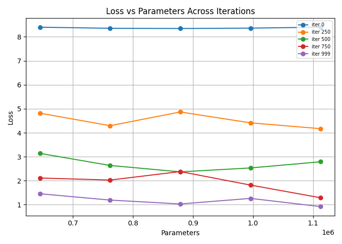
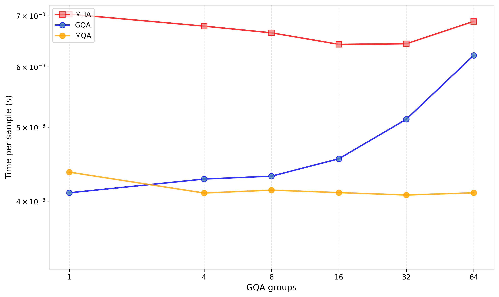

# A basic experiment to understand distributed MoE trainings, and perf 

also, to train an MoE model :D

# Accomplishments ... so far
1. Replication of Google's GQA paper: [https://arxiv.org/pdf/2305.13245](https://arxiv.org/pdf/2305.13245). Varied the GQA groups for 1 layer. See [this WandDB report](https://wandb.ai/anshc/moe-language-modeling-tiny/reports/Grouped-Query-Attention-Verification-Report--VmlldzoxNDM2OTcyMg?accessToken=jb6ejl24axd9i7op0h2vpva5t610nu9rn84i6lxx5aihnj71s8sm5zo6zxr7f73b) for the actual plot 
2. **9/19/2025** This framework is capable of training a GPT-2 like ["nano GPT" model](https://github.com/KellerJordan/modded-nanogpt). See [this sequence of steps](https://github.com/AnshKetchum/arcadium/blob/main/story/nanogpt.md) to reproduce the pretraining, and this [fineweb10B vall loss graph](https://wandb.ai/anshc/nano-gpt-speedrun/runs/bal8r3v5/workspace?nw=nwuserachaurasia&panelDisplayName=val_loss&panelSectionName=Charts) as proof. Project link as well [https://wandb.ai/anshc/nano-gpt-speedrun?nw=nwuserachaurasia](https://wandb.ai/anshc/nano-gpt-speedrun?nw=nwuserachaurasia)


# Setup 

```bash
uv pip install -r requirements.txt
```

# Pretraining from scratch

- Model params are in `configs/models/tiny-moe.yaml`
- Data params are in `configs/data/simple-corpus.yaml`
- Training params are in `configs/training/basic.yaml`

```bash
python pretrain_language.py
```

# Generating output using a pretrained LLM

It works, but output isn't that sensible.

```bash 
python generate_language.py --checkpoint_path "checkpoints/<checkpoint path>/<path to .pt file>" --input_data "Shakespeare produced most"
```


Underlying targets:

1. To understand VRAM capacity usage of MoEs! 

Current Interesting Findings:
    - Optimizers take more VRAM than model (specifically, the Adam optimizer takes 2 x more MB of VRAM than model weights)
    - Leading source of VRAM comes from *forward pass intermediates*

2. What is a fabric, and how do fabric parameters properly affect pre-training performance?
    - What is a fabric spine
    - What

3. How distributed perf actually pans out with comms latencies 

4. Make a sandbox to test kernels, perf optims, etc.

# Progress

*Before I began logging*
- Added VRAM estimates to see how VRAM is being utilized
- Interesting things from a HW pers

*8/31/2025*: 
- Pretraining seems to work, noting this as the lm_loss (cross entropy) seems to be going down. 
- Looks okay at a high level ... but then my tokens are all garbled in generation? Getting only "the"s as output.
- Could it be because we don't have enough useful data? Or because our param count is low? Let's try plotting attention maps, this seems like the quickest way to add in more interpretability

*9/1/2025*
- Updated the loss function, I'm no longer just pretraining based on the next token. I.e previously, I had it set up so that we were predicting a distribution of P(t_k | t_k_1, t_k-2, ...), i.e predicting the next token from a preexisting sequence. That may have been why my model was so bad! I made it more "next-token-like" by having the labels be the entire sequence shifted over by 1, i.e, each sequence's label is literally the next token now. Huh ... so that means that previously, my model was using the single next token for the sequence as labels for all tokens???  **TODO: expand more on this in a blog?**
- Output's has a LOT less the's. Yay! Now, it's sensible within small parts of the sentence, but doesn't seem to know how to properly start and end. Hmmm ... what to do? Some ideas:
    - Configure the loss function to specifically consider beginning-of-sequence tokens and end-tokens?
    - Just scale up data/params? Maybe this is emergent behaviour?
    - How do you know whether you are being limited by your sequence length during training?

*9/3/2025*
- Tried varying the input/output/embedding dimension. I'm thinking of just fixing this as one param.

- Seems like increasing dim from 64 -> 256 does have an effect on sensibility. New output - 

```python
"""Output text Shakespeare produced most of his known works between 1589 and 1613. His early plays were primarily comedies and histories and are regarded as some of the best works produced in these genres. He then wrote mainly tragedies until 1608, among them Hamlet, Othello, King James VI Losing team: Protégé project manager on the best works produced in these genres. He then wrote mainly tragedies until 1608, among them Hamlet, Othello, King Lear and Macbeth, all considered to be among them Hamlet, Othello, King Lear and Macbeth, all considered to be among the sources of the sources of the sources of the sources of"""
```

So, we've went from incoherant 'the's --> somewhat coherent partial sentences --> coherent but repetitive sentences.

*9/8/2025*

- Continuing off last session in 9/3, the big question is whether I need to focus my efforts on gathering more data, or increasing the parameter size. Initially, I had an idea, why don't we port the relatively standard "roofline" approach for workload analysis to hardware? Just like a workload is either compute or memory bound, a pretraining setup could be considered to be data or parameter bound, where perf is loss / total iters and our "arithmetic intensity" is tokens / param. Sounds cool, right? Turns out, if you train models (I varied the number of decoder layers in my transformer), this "roofline" curve just ends up being a regular loss curve (or an overlapping set of loss curves), as parameters stays constant per run. 
    - The consolation is that if we apply the roofline-like model to the loss curve, we can now think of the initial drop area as the model being "data-bound" (assuming x is tokens / param). Initially, tokens / param is really low, so we are in effect data bound. But as the loss plateaus towards convergence, we can claim we're ~parameter bound~ instead.


*9/9/2025*

- Continuing, what can we do to figure out whether we're data bound or model bound? Here's another idea - plot loss vs parameters, and loss vs. tokens. Effectively, we're assuming L = L(theta, D) i.e loss is a function of only data and parameters for this high level model. Plotting these two graphs, and then performing regressions can possibly give us additional insight into how the loss changes as a function or params and data. Literally, what I mean to say is to take the slope of loss vs params (loss / param) and loss vs data (loss / data), see which is more negative, and try to scale out in that direction. This image shows a small scale experiment for loss vs params. 




Sanity checks:
1. All models should have a similar loss at 0 iterations
2. Loss goes down with epochs. Training seems to be going great

Interesting points:
1. The graph looks somewhat linear??? 

Next steps: Scale out the hyper parameter search. For this, I've made this script [ablations/grid_search_decoder_layers.py](ablations/grid_search_decoder_layers.py). 

*9/10/2025*

- Continuing work on understanding the impacts of data. Adding 2 documents of data does seem to reduce the loss for larger models. In the case of 1M parameter models, we actually see a slight increase in cross-entropy loss. That probably can be explained through some inductive bias agreement.

Here's training metrics for an 8-layer decoder model without the 2 documents (trained via the `examples/smoe-8layer-small-data.sh` config).

```json
{
  "iter": 999,
  "loss": 1.2089617252349854,
  "trained_tokens": 256000,
  "param_count": 1987712,
  "estimated_flops": 1017708544
}
```

and with - 

```json
{
  "iter": 999,
  "loss": 0.6912261247634888,
  "trained_tokens": 256000,
  "param_count": 1987712,
  "estimated_flops": 1017708544
}
```

Quite a difference in terms for the CE function. Initial training metrics


```json
{
  "iter": 100,
  "loss": 6.736004829406738,
  "trained_tokens": 25856,
  "param_count": 1987712,
  "estimated_flops": 1017708544
}
```

and with - 

```json
{
  "iter": 100,
  "loss": 6.350053787231445,
  "trained_tokens": 25856,
  "param_count": 1987712,
  "estimated_flops": 1017708544
}
```

So, with additional data, we should expect lower loss at earlier stages. I assumed that initially the loss would be higher (and eventually converge to a lower loss). That doesn't seem to be the case.

The model outputs are, however, equally bad.

```python
Shakespeare produced most of John Ward, the Blackfriars indoor theatre. Extant records of Shakespeare's plays were on 23 April 1616, at the King's Men "placed men went into the King's Men "placed men went into the King's Men "placed men went into the King's Men "placed men went into the King's Men.[39] All the King's Men.[39] All the King's Men.[39] All the King's Men.[39] All the first two additional team for the first time in his time plays were on the first two additional team for the first two additional team for the first two additional team for the first two additional team
```

(no-data-model)

```python
Shakespeare produced most echo alternative. in the But bite and his jackfruit continue to be shreds and apart turned was pulled and raised in pork, braised At the lion’s of 18, he mane chew Kimberlie The India’s is also indicated that he mane chew Kimberlie The India’s is also went on the lion’s of the lion’s of the lion’s of the lion’s of the lion’s of the lion’s of the lion’s of the lion’s of the lion’s of the lion’s of the lion’s of the lion’s of the lion’s of the lion’s of figured grow His uneven bars, and 2x His vegan were
```

*9/11/2025*

Short update - ran into some interesting challenges implementing two things - 
  1. Validation with Eleuther AI's evaluation harness
  2. Sequence length warmup (checkout this run https://wandb.ai/anshc/moe-language-modeling-tiny/runs/jxik16ta?nw=nwuserachaurasia for the latest); motivation, minimize total training time.

Sequence length warmup has been implemented, but we're not seeing linearly increasing iter times. This makes me wonder whether the critical blocker in the setup is data loading, or logging.

*9/12/2025*

After a conversation with a researcher, I realized there's a largely untapped realm of exploration to be done when it comes to attention. While MHA is the standard implementation, in order to maximize operational (arithmetic) intensity towards compute-optimize training, researchers at Google came up with an a variant of attention known as Grouped Query Attention.

The value proposition was quite challenging to get at first, but it establishes that with MHA, `H` attention heads may push the intensity to be squarely in the memory bound region for compute. That's why, in practice, many models apparently don't even use MHA. In fact, they may use another extreme version that minimizes KV cache usage - MQA - which splits qkv projections into q and kv projections. All "query heads" are now sharing the one "key/value" head, which maximizes reuse, and reduces the number kv heads by a factor of H. Then comes GQA - grouped query attention - which balances the tradeoff here to trade off between operational intensity efficiency and performance.

Using `ablations/architecture/plot_multi_query_vs_multi_head.py`, here's a figure generated that replicates the original Google Research Paper.


